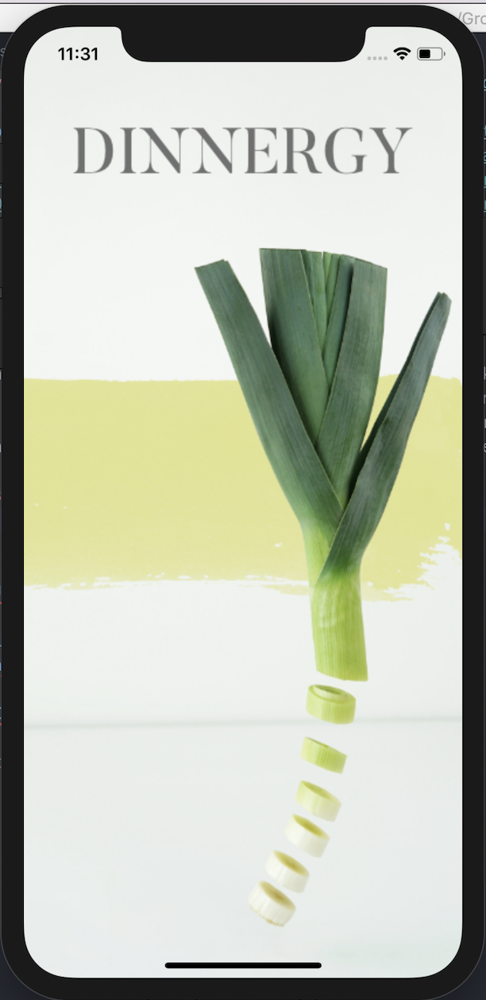

# Dinnergy [](https://travis-ci.org/jordantroberts/dinnergy)

### [Welcome to Edgy Eats](https://github.com/jordantroberts/dinnergy#Welcome-to-Edgy-Eats) - [Features](https://github.com/jordantroberts/dinnergy#Features) - [Screenshots](https://github.com/jordantroberts/dinnergy#Screenshots) - [Team](https://github.com/jordantroberts/dinnergy#Team) - [User Stories](https://github.com/jordantroberts/dinnergy#User-Stories) - [Our Process](https://github.com/jordantroberts/dinnergy#Our-Process) - [Quickstart](https://github.com/jordantroberts/dinnergy#Process)

## Welcome to Edgy Eats

Dinnergy is an iPhone application that allows users to plan a meal depending on available ingredients.

## Features
* User can add or remove ingredients to their current stock.
* The app gives you recipes based on your current ingredients and updates each time you add or remove an ingredient.
* Creates a shopping list based on selected recipe and ingredients that are currently unavailable to the user.
* User can use Apple maps to view nearby food banks or supermarkets

## Screenshots
<div align="center">
    
</div>

## Team
* [Carly Jenkinson](https://github.com/CarlyJ88)
* [Oliver Cripps](https://github.com/ocripps24)
* [Nandini Patel](https://github.com/Nandini0206)
* [Tara Sankhalpara](https://github.com/tsankhalpara)
* [Jordan Roberts](https://github.com/jordantroberts)
* [Simon Chenbo Yi](https://github.com/SimonChenboYi)

## User Stories

_MVP_

```
As a user
So that I can receive recommendations
I need to enter my current ingredients.

As a user
So that I can receive relevant recommendations
I would like to attribute a quantity to each of my current ingredients.

As a user
So that I can keep track of my current ingredients
I would like to delete an ingredient from my current ingredients.

As a user
So that I can choose a recipe
I would like to view a list of recipes.

As a user
So that I can see more details about a recipe
I would like to be able to view a single recipe.
```
_Additional Features_

```
As a user
So I know what ingredients to buy
I would like to generate a shopping list.

As a user
So that I can donate unused ingredients
I would like to be shown the nearby food banks.

As a user
So that I can buy the ingredients I don't yet have.
I would like to be shown the nearby supermarkets.
```

## Our Process

We agreed to follow an Agile Software Development process using Extreme Programming framework at the start of the 2-week development period. We carried this out via daily standups - one in the morning and one in the afternoon, regular retrospectives (at least 2-3 per week), and planned our 2-day sprints as a team, making sure each team member was clear on our collective aim.

1. The card wall is here: https://github.com/jordantroberts/dinnergy/projects/1
2. Project Wiki: https://github.com/jordantroberts/dinnergy/wiki

## Quickstart

### Running the app

1. git clone https://github.com/jordantroberts/dinnergy
2. Open the Dinnergy file in Xcode.
3. `cmd + r` (to run the app).
4. The app will launch in the simulator. This app can be used on any iOS device but is designed for iPhone.

### Running the tests

1. Repeat steps 1-3 of running the app.
2. Configure your Simulator to an iPhone X or XR.
3. From the Simulator menu, select Hardware -> Keyboard -> Connect Hardware Keyboard.
4. Type `cmd + u` from Xcode to run the tests, which will launch in the simulator.
